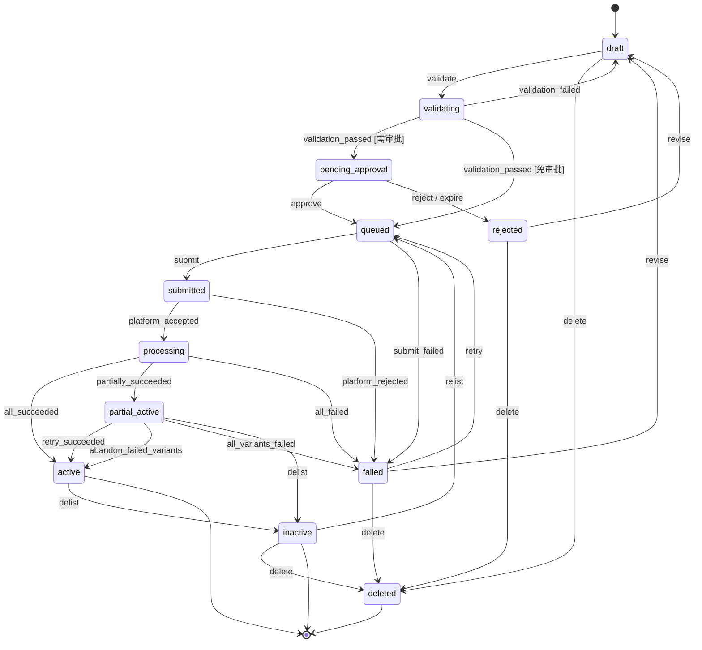
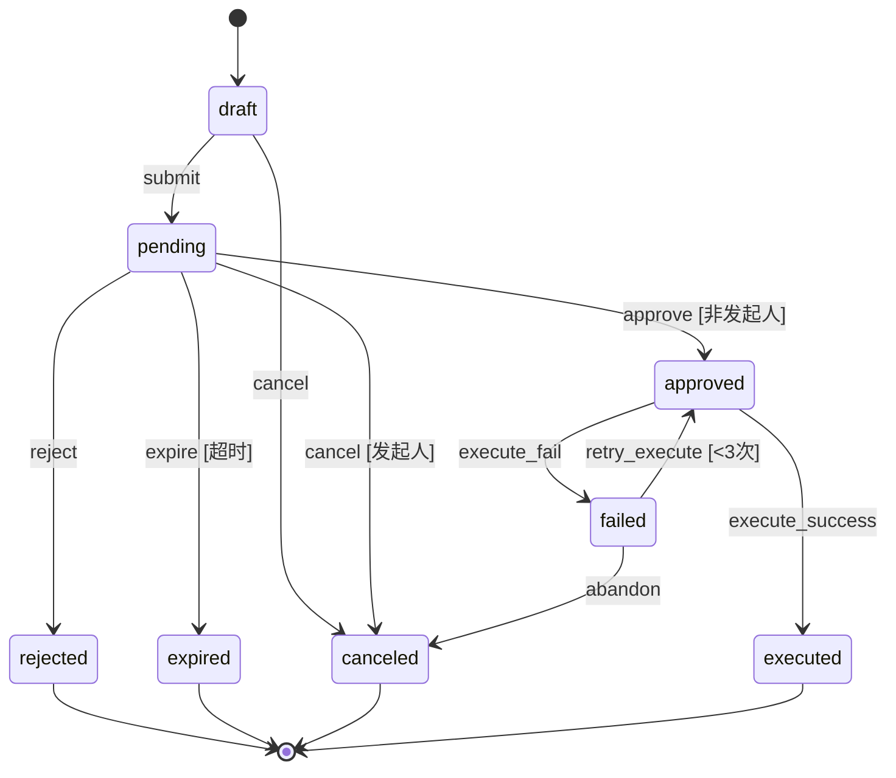
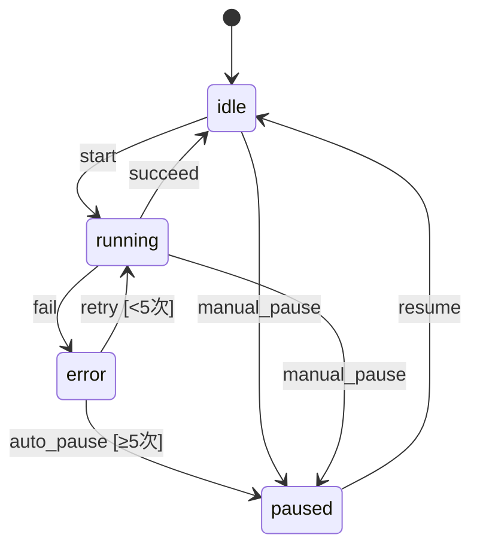
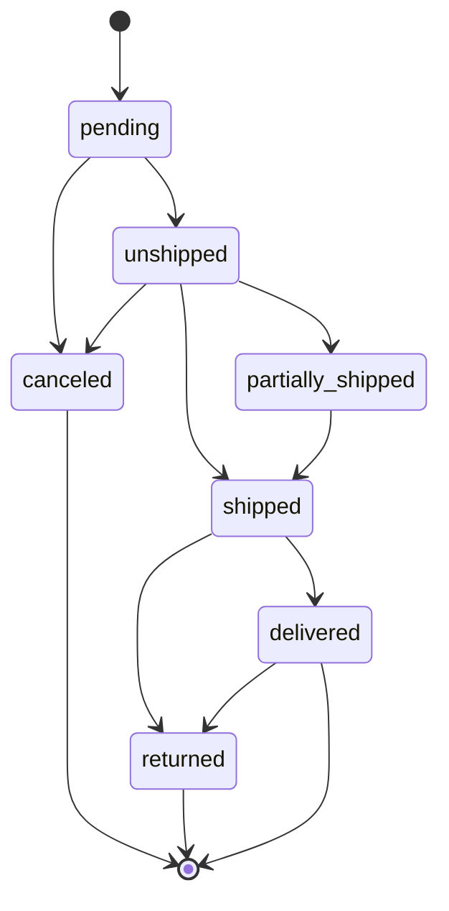
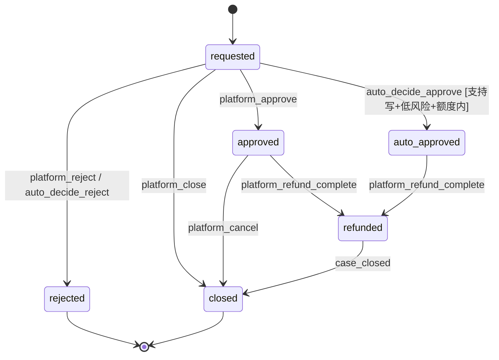
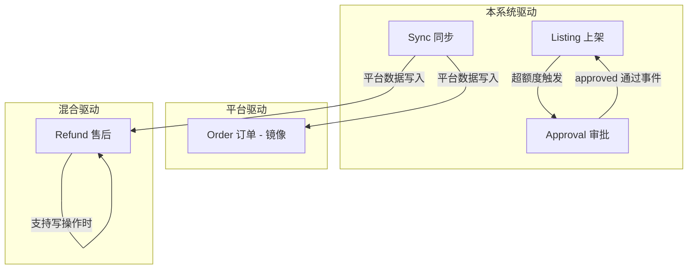

# TDD-04 核心状态机

| 项 | 内容 |
|---|---|
| 文档版本 | v1.0（设计评审稿） |
| 创建日期 | 2026-09-28 |
| 上游文档 | `PRD-AI全链路电商自动化平台-v1.1.md`、`TDD-01-技术设计总纲.md`、`TDD-02-数据模型设计.md`、`TDD-03-平台适配器契约.md` |
| 文档编号 | TDD-04 |
| 严重度 | **阻塞级**（状态机定错，返工成本最高） |
| 状态 | **待评审，未开工** |

---

## 0. 这份文档要解决什么问题

PRD v1.1 多处提到"状态机驱动"，但没有一处定义了完整的状态集合与转换规则。开发时必然卡在：

- 上架从 `draft` 到 `active` 中间有哪些必经状态？哪些可以直接跳？
- 审批被拒绝后能不能改一改重新提交？还是必须新建？
- 同步任务失败了，`sync_cursors.status` 怎么从 `error` 回到 `running`？
- `partial_active`（部分成功）这个状态究竟怎么定义？什么时候进入、什么时候离开？

本文档给出**5 个核心状态机**的严格定义。**所有状态机实现为声明式表（数据驱动），而非散落各处的 if/else。**

---

## 1. 设计原则（本册专属）

| # | 原则 | 说明 |
|---|---|---|
| S1 | **状态转换必须显式声明** | 转换表是唯一真相；代码不得用 `if status == ...` 硬编码流 |
| S2 | **转换有前置条件（guard）** | 每个转换可声明 `guard`，不满足则拒绝（不是抛异常，是返回失败原因） |
| S3 | **每次转换必须记录事件** | 写入 `state_transitions` 表（append-only），含 from/to/actor/reason |
| S4 | **终态明确** | 终态不可再转换（除特批的 reopen）；终态定义清楚避免"状态回魂" |
| S5 | **非法转换返回明确错误** | 抛 `InvalidTransitionError`，携带当前状态与允许的目标状态列表（前端能直接展示） |
| S6 | **状态变更与副作用解耦** | 状态机只管状态；发通知、起任务由事件监听器处理（避免事务里做外部调用） |
| S7 | **幂等** | 同状态重复触发同一转换 → 直接返回成功（不报错、不重复记事件） |
| S8 | **乐观锁保护** | 转换基于 `updated_at` 或 `version` 校验，防并发覆盖 |

### 1.1 为什么用声明式状态机

**反面例子（必须避免）**：

```python
# ❌ 错误做法：状态流转散落在业务代码里
if listing.listing_status == "draft":
    if user.has_permission("listing.publish"):
        listing.listing_status = "validating"
    else:
        raise PermissionError()
elif listing.listing_status == "validating":
    if result.is_valid:
        if amount > threshold:
            listing.listing_status = "pending_approval"
        else:
            listing.listing_status = "queued"
# ... 200 行后，没人知道到底允许哪些转换
```

**正确做法**：

```python
# ✅ 状态机定义为数据
LISTING_TRANSITIONS: list[Transition] = [
    Transition("draft", "validating", guard=has_publish_permission),
    Transition("validating", "pending_approval", guard=requires_approval),
    Transition("validating", "queued", guard=lambda ctx: not requires_approval(ctx)),
    # ...
]

# 业务代码只调用
await machine.fire(listing, "publish", context={"actor": user})
```

**收益**：状态图可自动生成的（Mermaid / 前端流程图）、可测试（穷举所有转换）、可审计（转换表就是文档）。

### 1.2 状态机基类设计

```python
# domain/state_machines/base.py
from dataclasses import dataclass
from typing import Callable, Any


@dataclass(frozen=True, slots=True)
class Transition:
    """一条状态转换规则。"""
    source: str                       # 源状态
    target: str                       # 目标状态
    event: str                        # 触发事件名
    guard: Callable[[Any], bool] | None = None   # 前置条件
    guard_message: str | None = None  # 条件不满足时的提示
    requires_reason: bool = False     # 是否强制填原因
    requires_role: tuple[str, ...] = ()  # 需要的角色


class StateMachine:
    """声明式状态机基类。

    子类只需定义：states / initial / terminal / transitions
    """

    states: frozenset[str]
    initial: str
    terminal: frozenset[str]
    transitions: tuple[Transition, ...]

    @classmethod
    def allowed_events(cls, current: str) -> list[str]:
        """当前状态允许的事件列表（前端按钮渲染用）"""

    @classmethod
    def can_fire(cls, current: str, event: str, ctx: Any) -> tuple[bool, str | None]:
        """能否触发。返回 (可否, 拒绝原因)"""

    @classmethod
    def next_state(cls, current: str, event: str) -> str:
        """按事件推目标状态。无此转换抛 InvalidTransitionError"""


class InvalidTransitionError(Exception):
    """非法状态转换。

    携带 current / event / allowed_targets，供前端展示可行动作。
    """
    def __init__(self, *, current: str, event: str, allowed: list[str]) -> None:
        self.current = current
        self.event = event
        self.allowed = allowed
        super().__init__(
            f"状态 {current} 不支持事件 {event}；当前可执行：{', '.join(allowed) or '无'}"
        )
```

### 1.3 状态转换事件表

**所有状态机的每次转换都写入同一张表**（补 TDD-02）：

```sql
-- 状态转换事件（append-only，所有状态机共用）
CREATE TABLE state_transitions (
    id             BIGSERIAL PRIMARY KEY,
    tenant_id      BIGINT NOT NULL,
    machine        VARCHAR(64) NOT NULL,      -- listing / approval / sync / order / refund
    entity_type    VARCHAR(64) NOT NULL,      -- product_listings / approvals / ...
    entity_id      BIGINT NOT NULL,
    from_state     VARCHAR(64),
    to_state       VARCHAR(64) NOT NULL,
    event          VARCHAR(64) NOT NULL,
    actor_type     VARCHAR(16) NOT NULL CHECK (actor_type IN ('user','system','platform')),
    actor_id       BIGINT,
    reason         TEXT,
    context        JSONB,                     -- guard 求值上下文摘要
    trace_id       VARCHAR(64),
    created_at     TIMESTAMPTZ NOT NULL DEFAULT now()
);

CREATE INDEX idx_transitions_entity
    ON state_transitions(machine, entity_id, created_at DESC);
CREATE INDEX idx_transitions_trace ON state_transitions(trace_id)
    WHERE trace_id IS NOT NULL;

-- append-only 强制（与 audit_events 同策略）
REVOKE UPDATE, DELETE ON state_transitions FROM PUBLIC;
```

**为什么单独建表而不复用 `audit_events`**：`audit_events` 记录业务事实（谁改了价、谁审批了），`state_transitions` 记录状态流转（用于状态图分析、卡点诊断）。两者粒度不同，混在一起查询会很难受。**这是 TDD-02 的补充项，需回写。**

**这张表的实用价值**：可以回答"上架平均在 `pending_approval` 停留多久"这类运营问题，直接支撑 PRD 3.4 的审批效率度量。

---

## 2. 状态机一：上架（Listing）

### 2.1 状态集合（12 个，与 TDD-02 严格一致）

| 状态 | 中文 | 含义 | 是否终态 |
|---|---|---|---|
| `draft` | 草稿 | 本地创建，未校验 | — |
| `validating` | 校验中 | 正在做本地 + 平台校验 | — |
| `pending_approval` | 待审批 | 校验通过，等待人工审批 | — |
| `rejected` | 已驳回 | 审批被拒 | — |
| `queued` | 已入队 | 审批通过/免审批，等待提交 | — |
| `submitted` | 已提交 | 已调用平台（异步平台为 Feed 已创建） | — |
| `processing` | 处理中 | 平台处理中（轮询） | — |
| `active` | 已上线 | 全部成功，可售 | ✅ |
| `partial_active` | 部分上线 | 多变体中部分成功 | — |
| `inactive` | 已下架 | 曾上线，现已下架 | ✅（可 reopen） |
| `failed` | 失败 | 提交或处理失败，需人工 | — |
| `deleted` | 已删除 | 逻辑删除 | ✅ |

**关键判断 1：`validating` 是必须的独立状态吗？**

是。理由：
- 校验可能耗时（要拉平台类目 schema、检查类目资格）
- 校验失败的记录需要保留（用于分析"哪种商品容易校验失败"）
- 用户能看到"正在校验"的反馈，而不是卡在 `draft` 无响应

**关键判断 2：`rejected` 之后怎么走？**

两种设计：
- **A**：`rejected` → `draft`（改完重新走全流程）
- **B**：`rejected` → `validating`（直接重新提交）

**本设计选 A**，理由：审批被拒通常意味着商品信息需要实质修改。回到 `draft` 强制重新校验，避免"改了价格绕过校验"的风险。同时保留 `rejected` 记录的历史（通过 `state_transitions` 表），不丢失审计链路。

**关键判断 3：`partial_active` 的准确定义**

这是最容易被含糊处理的状态。**精确定义**：

- 适用场景：**多变体商品**（父子 ASIN）或 **批量提交多个 SKU**
- 进入条件：**至少一个子项成功，且至少一个子项失败**
- 业务含义：商品可售但**不完整**，必须人工处理后补发
- 离开条件：仅两途 —— ① 失败子项补发成功 → `active`；② 人工确认放弃失败子项 → `active`（记 reason）

**为什么不能简单归为 `failed`**：`partial_active` 时商品在卖，会产生订单和收入。如果标记为 `failed`，运营会以为没上架成功而不监控库存——这是真实的业务风险。

**为什么不能简单归为 `active`**：还有 SKU 没上，不完整。

### 2.2 转换表

```python
# domain/state_machines/listing.py
LISTING_TRANSITIONS: tuple[Transition, ...] = (
    # ---- 创建与校验 ----
    Transition("draft", "validating", "validate",
               guard=has_non_empty_required_fields,
               guard_message="必填字段不完整，无法校验"),
    Transition("validating", "draft", "validation_failed"),
    Transition("validating", "pending_approval", "validation_passed",
               guard=requires_approval_listing,
               guard_message="该操作超过免审批额度，需审批"),
    Transition("validating", "queued", "validation_passed",
               guard=lambda ctx: not requires_approval_listing(ctx)),

    # ---- 审批 ----
    Transition("pending_approval", "queued", "approve"),
    Transition("pending_approval", "rejected", "reject",
               requires_reason=True),
    Transition("pending_approval", "rejected", "expire",
               requires_reason=True),      # 超时自动驳回（审批状态机联动）

    # ---- 驳回后返工（见 2.1 关键判断 2）----
    Transition("rejected", "draft", "revise",
               guard=has_edit_permission),

    # ---- 提交与处理 ----
    Transition("queued", "submitted", "submit"),
    Transition("queued", "failed", "submit_failed",
               requires_reason=True),
    Transition("submitted", "processing", "platform_accepted"),
    Transition("submitted", "failed", "platform_rejected",
               requires_reason=True),

    # ---- 异步处理结果（三分支，关键）----
    Transition("processing", "active", "all_succeeded"),
    Transition("processing", "partial_active", "partially_succeeded"),
    Transition("processing", "failed", "all_failed",
               requires_reason=True),

    # ---- partial_active 的出路（见下）----
    Transition("partial_active", "active", "retry_succeeded"),
    Transition("partial_active", "active", "abandon_failed_variants",
               requires_reason=True, requires_role=("ops_lead",)),
    Transition("partial_active", "failed", "all_variants_failed",
               requires_reason=True),

    # ---- 线上管理 ----
    Transition("active", "inactive", "delist"),
    Transition("partial_active", "inactive", "delist"),
    Transition("inactive", "queued", "relist"),   # 重新上架走提交链路

    # ---- 失败重试 ----
    Transition("failed", "queued", "retry"),
    Transition("failed", "draft", "revise"),

    # ---- 删除（从任何非终态可达，但需权限）----
    Transition("draft", "deleted", "delete"),
    Transition("rejected", "deleted", "delete"),
    Transition("failed", "deleted", "delete"),
    Transition("inactive", "deleted", "delete"),
)
```

### 2.3 状态图



### 2.4 与适配器的联动（关键实现细节）

上架状态机的 `submitted` → `processing` → 终态，**必须由 `poll_submission` 驱动**，且要区分平台能力：

| 平台能力 | 编排路径 |
|---|---|
| `NATIVE` | `queued` → `submit` → 直接拿到结果 → 判定 `active` / `partial_active` / `failed`（不经 `submitted`/`processing`） |
| `ASYNC` | `queued` → `submit` → `submitted`（存 `submission_id`）→ 轮询 → `processing` → 终态 |
| `FILE_IMPORT` | `queued` → 生成文件 → 人工上传 → 人工回填结果 → 终态（**不经 `submitted`**） |
| `MANUAL` | `queued` → 生成待办 → 人工处理后回填 |

**重要说明**：`submitted` 和 `processing` 两个状态**只对 `ASYNC` 平台有意义**。对 `NATIVE` 平台，状态机会从 `queued` 直接跳到终态。这不违反状态机定义——状态机允许"不是所有状态都被使用"。

**但 `poll_submission` 的超时必须处理**：

```python
# 轮询超时策略
POLL_TIMEOUT = {
    "default": timedelta(minutes=30),
    "amazon_feed": timedelta(minutes=120),   # Amazon Feed 处理慢
}

# 超时后：processing → failed
Transition("processing", "failed", "poll_timeout",
           requires_reason=True)
# 必须补进 2.2 的转换表
```

**这条转换必须加入转换表**（我在 2.2 中遗漏了，此处明确）：当轮询超过 `POLL_TIMEOUT`，状态机触发 `poll_timeout` 事件，从 `processing` 转 `failed`，并生成人工待办——**因为此时商品可能已经上架成功了，不能简单重试**。

### 2.5 幂等与并发

| 场景 | 处理 |
|---|---|
| 重复点"提交上架" | `queued` + `submit` 事件重复触发 → 若已有 `submission_id` 则直接返回，不重复提交 |
| 两个用户同时审批 | 乐观锁：`approvals.status` 从 `pending` 改为 `approved` 时带 `WHERE status='pending'`，影响行数为 0 则说明已被处理 |
| 轮询任务重复执行 | 检查当前状态是否仍在 `processing`；已到终态则跳过 |
| 网络超时后不知道是否提交成功 | `idempotency_key` + `submission_id` 存储；重试时先查是否有 `submission_id` |

**硬性要求**：`queued` → `submitted` 的转换函数必须**先查 `submission_id` 是否已存在**。这是防重复上架的最后一道闸。

---

## 3. 状态机二：审批（Approval）

### 3.1 状态集合（8 个）

| 状态 | 中文 | 含义 | 是否终态 |
|---|---|---|---|
| `draft` | 草稿 | 审批单已建但未提交 | — |
| `pending` | 待审批 | 已提交，等待审批人 | — |
| `approved` | 已通过 | 审批通过，等待执行 | — |
| `rejected` | 已驳回 | 审批被拒 | ✅ |
| `expired` | 已超时 | 超时未处理 | ✅ |
| `canceled` | 已撤销 | 发起人撤销 | ✅ |
| `executed` | 已执行 | 执行完成（成功） | ✅ |
| `failed` | 执行失败 | 执行失败 | — |

**关键判断 1：为什么 `approved` 和 `executed` 分开？**

因为审批通过 ≠ 执行成功。平台可能拒绝（如商品已下架不能改价）、网络可能失败。分开后：

- `approved` 是"人已同意"
- `executed` 是"事已办成"

合并会导致"审批通过但实际没生效"的情况无法追踪。**这是审批系统最常见的设计错误。**

**关键判断 2：`expired` 之后能不能重新提交？**

不能直接转换到 `pending`。必须新建一条审批单。理由：审批的价值在于"对人的决策留痕"，超时后重新提交应该重新走决策，否则审批人可能基于过时信息判断。

**关键判断 3：`failed` 之后怎么办？**

两个出路：
- `failed` → `approved`（重试执行，不重新审批）—— 适用于纯技术失败
- `failed` → `canceled`（放弃）

**为什么允许回到 `approved`**：如果是网络超时这类技术失败，要求重新审批是浪费。但**必须记录重试次数**，超过 3 次强制转 `canceled` 并要求重新发起（防止无限重试掩盖真问题）。

### 3.2 转换表

```python
# domain/state_machines/approval.py
APPROVAL_TRANSITIONS: tuple[Transition, ...] = (
    Transition("draft", "pending", "submit",
               guard=has_required_payload),
    Transition("draft", "canceled", "cancel"),

    Transition("pending", "approved", "approve",
               guard=is_not_requester,          # 职责分离！
               guard_message="发起人不能审批自己提交的申请",
               requires_role=("approver", "admin")),
    Transition("pending", "rejected", "reject",
               guard=is_not_requester,
               requires_reason=True,
               requires_role=("approver", "admin")),
    Transition("pending", "expired", "expire",
               requires_reason=True),           # 定时任务触发
    Transition("pending", "canceled", "cancel",
               guard=is_requester,              # 只有发起人能撤销
               requires_reason=True),

    Transition("approved", "executed", "execute_success"),
    Transition("approved", "failed", "execute_fail",
               requires_reason=True),

    # 技术失败可重试，但有次数上限
    Transition("failed", "approved", "retry_execute",
               guard=lambda ctx: ctx.retry_count < 3,
               guard_message="重试已达上限，请重新发起审批"),
    Transition("failed", "canceled", "abandon",
               requires_reason=True),
)
```

### 3.3 状态图



### 3.4 与 `listings` 状态机的联动（重要）

审批与上架是**两个状态机联动**，必须定义清楚联动规则，否则会出现"审批通过了但商品状态没变"：

| 审批事件 | 上架状态机反应 | 实现方式 |
|---|---|---|
| 审批单创建（`pending`） | 若由 `listings` 发起，`listing_status` 已在 `pending_approval` | 同事务写入 |
| 审批通过（`approved`） | 触发 `approve` 事件 → `queued` | 事件监听器（**不在审批事务内**） |
| 审批驳回（`rejected`） | 触发 `reject` 事件 → `rejected` | 事件监听器 |
| 审批超时（`expired`） | 触发 `expire` 事件 → `rejected` | 事件监听器 |
| 审批单撤销（`canceled`） | 触发 `cancel` → 回 `draft` 或保持 | 取决于类型 |
| 执行成功（`executed`） | 无变化（商品状态由平台同步更新） | — |

**关键设计：审批通过后不直接改上架状态，而是发事件**

理由（原则 S6）：审批事务内不应该做业务编排。如果审批事务里直接改 `listing_status` 并起任务，一旦事务回滚就产生了"审批通过但任务已起"的不一致。

**实现方式**：用 **事务内写 outbox，事务外消费**：

```sql
-- 补 TDD-02：事务性 outbox（保证事件与状态变更原子）
CREATE TABLE domain_events (
    id             BIGSERIAL PRIMARY KEY,
    tenant_id      BIGINT NOT NULL,
    event_type     VARCHAR(64) NOT NULL,     -- approval.approved / listing.submitted ...
    aggregate_type VARCHAR(64) NOT NULL,
    aggregate_id   BIGINT NOT NULL,
    payload        JSONB NOT NULL,
    -- 消费状态
    status         VARCHAR(16) NOT NULL DEFAULT 'pending'
                   CHECK (status IN ('pending','processing','done','failed')),
    attempts       INTEGER NOT NULL DEFAULT 0,
    last_error     TEXT,
    available_at   TIMESTAMPTZ NOT NULL DEFAULT now(),  -- 延迟重试
    processed_at   TIMESTAMPTZ,
    trace_id       VARCHAR(64),
    created_at     TIMESTAMPTZ NOT NULL DEFAULT now()
);

CREATE INDEX idx_domain_events_pending ON domain_events(status, available_at)
    WHERE status IN ('pending','failed');
```

**为什么不用 Celery 的 `delay()` 直接发**：`task.delay()` 在事务提交前发出，若事务随后回滚，任务已经跑了，形成幽灵事件。**Outbox 模式是解决这个问题的标准方案**，且不需要引入 Kafka（符合 TDD-01 的不引入清单）。

**这是 TDD-02 的第三个补充项。**

### 3.5 超时与升级

```python
# 审批超时配置（TDD-05 承载实际值）
APPROVAL_TIMEOUT = {
    "low": timedelta(hours=24),
    "medium": timedelta(hours=8),
    "high": timedelta(hours=4),
    "critical": timedelta(hours=1),
}
```

**超时处理链**：

1. 定时任务（每 10 分钟）扫描 `approvals` 中 `status='pending' AND expires_at < now()`
2. 触发 `expire` 事件 → `approvals.status = 'expired'`
3. 写入 `domain_events` → 通知发起人
4. 联动 `listings` 状态机的 `expire` 事件

**升级机制（`escalate_after_minutes`，见 TDD-02 `alert_rules`）**：审批时效过半时提醒，超时时升级到上级。**注意区分"审批超时"和"提醒升级"两个概念**——前者改变状态，后者只发通知。

---

## 4. 状态机三：同步（Sync）

### 4.1 状态集合（4 个）

对应 TDD-02 的 `sync_cursors.status`：

| 状态 | 含义 | 转换条件 |
|---|---|---|
| `idle` | 空闲，等待下次调度 | 初始状态；任务完成后回到此 |
| `running` | 正在同步 | 任务开始 |
| `error` | 同步失败 | 任务异常 |
| `paused` | 已暂停 | 连续失败或人工暂停 |

### 4.2 转换表

```python
# domain/state_machines/sync.py
SYNC_TRANSITIONS: tuple[Transition, ...] = (
    Transition("idle", "running", "start"),
    Transition("running", "idle", "succeed"),
    Transition("running", "error", "fail",
               requires_reason=True),
    Transition("error", "running", "retry",
               guard=lambda ctx: ctx.consecutive_failures < 5,
               guard_message="连续失败达 5 次，已自动暂停"),
    Transition("error", "paused", "auto_pause",      # 连续失败触发
               requires_reason=True),
    Transition("paused", "idle", "resume",
               requires_role=("ops", "admin")),
    Transition("idle", "paused", "manual_pause",
               requires_role=("ops", "admin")),
    Transition("running", "paused", "manual_pause",
               requires_role=("ops", "admin")),
)
```

### 4.3 关键规则

**规则 1：`error` → `paused` 自动触发条件是连续失败 5 次**

**为什么不能无限重试**：如果店铺 Token 失效，重试 100 次也没用，只会刷爆日志和告警。5 次是一个经验值（TDD-05 可配）。

**规则 2：游标只在成功时前移**

```python
# ✅ 正确：成功才前移
async def sync_orders(shop_id: int) -> None:
    cursor = await repo.get_cursor(shop_id, "orders")
    new_cursor = cursor.value

    async for page in adapter.fetch_orders(time_range=...):
        await repo.upsert_orders(page.data)
        new_cursor = page.next_token or page.data[-1].updated_at  # 只在内存中推进

    # 全部成功才写回
    await repo.update_cursor(shop_id, "orders", value=new_cursor,
                             last_success_at=now())

# ❌ 错误：每页都写游标，中途失败会丢数据
```

**这是增量同步最容易写错的地方**。写进 `apps/worker/AGENTS.md`。

**规则 3：失败时的游标处理**

| 情况 | 游标动作 |
|---|---|
| 第 3 页失败（共 10 页） | 游标不动（下次从第 1 页重来，靠 upsert 幂等去重） |
| 全部成功但记录数异常少 | 游标前移，但标记 `sync_watermarks.integrity_status = 'gaps_detected'` |
| 部分记录 UPsert 失败 | 整批回滚，游标不动 |

**规则 4：全量对账（水位检查）**

PRD 10.2.2 要求"最后完整核对时间"。实现：

```python
# 每周一次全量对账（比增量更慢，但能发现缺口）
async def full_reconcile(shop_id: int, resource: str) -> None:
    """拉取近 30 天全量数据，与本地比对。

    发现缺口 → integrity_status = 'gaps_detected' + 生成补数任务
    正常 → 更新 last_full_check_at
    """
```

### 4.4 状态图



---

## 5. 状态机四：订单（Order）— 只读镜像

### 5.1 重要说明：订单状态机是"镜像"而非"驱动"

**这是一个必须澄清的设计立场**：

订单状态由**平台**决定，本系统**不做订单状态流转**。`orders.order_status` 是平台状态的**本地镜像**，同步任务负责更新它。

因此这个"状态机"的作用与其他四个不同：

| 状态机 | 方向 | 谁驱动 |
|---|---|---|
| Listing | 本系统 → 平台 | 本系统 |
| Approval | 纯本地 | 本系统 |
| Sync | 纯本地 | 本系统 |
| **Order** | **平台 → 本系统** | **平台** |
| Refund | 本系统 → 平台（部分平台） | 混合 |

**为什么不把订单状态机做成可写**：本系统定位是经营分析，不是 OMS（PRD 2.3 已声明不做 WMS/OMS）。如果自己维护订单状态，就会与平台产生冲突（平台改了状态我们不知道），最终数据不可信。

### 5.2 状态集合（7 个，与 TDD-02 一致）

| 状态 | 含义 |
|---|---|
| `pending` | 待处理（已下单未确认） |
| `unshipped` | 未发货 |
| `partially_shipped` | 部分发货 |
| `shipped` | 已发货 |
| `delivered` | 已签收 |
| `canceled` | 已取消 |
| `returned` | 已退回 |

### 5.3 允许的换向

虽然由平台驱动，但仍需声明**允许的转换**，用于：
- 校验同步到的状态是否合理（异常状态变化触发告警）
- 前端展示状态流

```python
# domain/state_machines/order.py
"""订单状态机：声明平台可能的状态流转，用于校验与展示。

注意：本系统不主动触发这些转换，只校验同步结果。
"""

ORDER_TRANSITIONS: tuple[Transition, ...] = (
    Transition("pending", "unshipped", "platform_confirm"),
    Transition("pending", "canceled", "platform_cancel"),
    Transition("unshipped", "partially_shipped", "platform_partial_ship"),
    Transition("unshipped", "shipped", "platform_ship"),
    Transition("unshipped", "canceled", "platform_cancel"),
    Transition("partially_shipped", "shipped", "platform_ship_rest"),
    Transition("shipped", "delivered", "platform_deliver"),
    Transition("shipped", "returned", "platform_return"),
    Transition("delivered", "returned", "platform_return"),
)

# 异常换向白名单（平台的真实行为总比文档多）
ORDER_ANOMALY_ALLOWED: frozenset[tuple[str, str]] = frozenset({
    ("canceled", "unshipped"),     # 平台撤销取消（确有发生）
    ("shipped", "canceled"),       # 发货后取消（拦截成功）
    ("returned", "shipped"),       # 退货撤销
})

# 其他未声明的换向 → 记录告警但不阻断（数据仍写入，标记 anomaly_flag）
```

**关键设计：异常换向不阻断，只告警**

理由：如果同步数据的换向不符合预期就拒绝写入，会导致本地数据与平台脱节，比"接受异常并告警"更糟。**数据完整性优先于状态纯洁性。**

**`orders` 表需补充字段**（回写 TDD-02）：

```sql
-- 补充字段
ALTER TABLE orders ADD COLUMN anomaly_flag BOOLEAN NOT NULL DEFAULT FALSE;
ALTER TABLE orders ADD COLUMN anomaly_detail JSONB;
```

### 5.4 状态图



### 5.5 订单金额的口径时间冲突（必须评审）

TDD-02 的 `orders` 有 `order_time`（经营口径）和 `settle_time`（财务口径）。同一条订单记录的状态变化会导致**两个口径的时间字段分别更新**：

| 事件 | 更新字段 |
|---|---|
| 下单 | `order_time` |
| 发货 | `ship_time` + `order_status` |
| 结算 | `settle_time` |

**风险**：如果只同步增量（按 `order_time`），已下单订单的发货/结算变化**不会被捕获**。

**解决方案（重要）**：

```python
# 订单同步必须双轨
async def sync_orders(shop_id: int) -> None:
    # 轨道 1：按 order_time 拉新订单
    await _sync_new_orders(shop_id)

    # 轨道 2：按 updated_at 拉最近 14 天的订单（捕获状态变化）
    #   14 天是经验值：覆盖发货+结算的典型周期
    await _sync_recent_updates(shop_id, days=14)
```

**为什么要回看 14 天**：Amazon 订单从下单到结算可能跨 2-6 周（含退货期）。14 天能覆盖发货与大部分结算。**退款/拒付可能更晚到达，由 `settlement` 同步专项处理，不依赖订单同步。**

**这是 PRD 10.2.2 "同步协议"中未明确的细节，需评审确认回看窗口。**

---

## 6. 状态机五：售后（Refund）— 混合驱动

### 6.1 状态集合（6 个，与 TDD-02 一致）

| 状态 | 含义 | 谁驱动 |
|---|---|---|
| `requested` | 买家已申请 | 平台 |
| `approved` | 已批准（待退款） | 平台 or 本系统 |
| `auto_approved` | 自动化规则批准 | **本系统** |
| `rejected` | 已拒绝 | 平台 or 本系统 |
| `refunded` | 已退款 | 平台 |
| `closed` | 已关闭（含撤诉） | 平台 |

### 6.2 转换表与能力分支

```python
# domain/state_machines/refund.py
REFUND_TRANSITIONS: tuple[Transition, ...] = (
    # 平台可能的流转（镜像部分）
    Transition("requested", "approved", "platform_approve"),
    Transition("requested", "rejected", "platform_reject"),
    Transition("requested", "closed", "platform_close"),

    # 本系统自动决策（仅当平台支持写操作）
    Transition("requested", "auto_approved", "auto_decide_approve",
               guard=lambda ctx: (
                   ctx.platform_supports_refund_write
                   and ctx.risk_level == "low"
                   and ctx.amount <= ctx.auto_refund_limit
               ),
               guard_message="超出自动退款额度或风险等级过高，需人工处理"),
    Transition("requested", "rejected", "auto_decide_reject",
               guard=lambda ctx: ctx.fraud_score > ctx.fraud_threshold,
               requires_reason=True),

    # 退款完成
    Transition("approved", "refunded", "platform_refund_complete"),
    Transition("auto_approved", "refunded", "platform_refund_complete"),
    Transition("approved", "closed", "platform_cancel"),

    Transition("refunded", "closed", "case_closed"),
)
```

### 6.3 关键：平台能力决定"能否自动执行"

这是 TDD-03 能力矩阵在状态机上的直接体现：

| 平台 | `REFUND_CREATE` | 状态机行为 |
|---|---|---|
| Amazon | `UNSUPPORTED` | **不进入 `auto_approved`**。系统只做"分类 + 建议"，生成人工待办；状态变化全部由平台同步驱动 |
| TikTok / Shopee / Lazada / Shopify | `NATIVE` | 可走 `auto_approved`，系统可执行退款 |

**guard 中直接检查 `platform_supports_refund_write`**，而不是在业务代码里判断平台名。这体现了原则 A2（能力驱动，非平台名驱动）。

### 6.4 自动决策的留痕要求

TDD-02 的 `refunds` 表有 `auto_decision JSONB` 字段。**每次自动决策必须写入**：

```json
{
  "decision": "approve",
  "rule_version": "refund_rules_v3",
  "matched_rules": [
    {"rule_id": "R-001", "name": "金额小于50美元且原因为尺寸不符", "result": "pass"},
    {"rule_id": "R-007", "name": "买家历史退款率低于10%", "result": "pass"}
  ],
  "fraud_score": 0.12,
  "factors": {
    "amount": 35.00,
    "buyer_refund_rate": 0.05,
    "product_defect_rate": 0.02,
    "reason_category": "size"
  },
  "llm_assisted": false
}
```

**为什么必须这么详细**：PRD 12.5 要求"自动化判定留痕"。当买家投诉"为什么给我拒了"，需要能复现当时的决策依据。**只有决策结果没有依据，等于没有审计能力。**

### 6.5 状态图



---

## 7. 五个状态机的关系总览



**四个联动点（必须实现）**：

| # | 联动 | 触发方式 | 说明 |
|---|---|---|---|
| 1 | Listing → Approval | `validating` + 需审批 → 创建审批单 | 上架校验通过后判断是否需审批 |
| 2 | Approval → Listing | `approved` 事件 → Listing `approve` | 通过 outbox 异步 |
| 3 | Sync → Order | 同步任务写入订单状态 | 状态机只校验，不驱动 |
| 4 | Sync → Refund | 同步任务写入退款状态 | 同上 |

**联动 1 的实现注意**：创建审批单与 `listing_status` 变为 `pending_approval` 必须在**同一事务**（否则会出现"审批单建了但商品还在校验中"）。

---

## 8. 与 TDD-02 的差异说明（需回写）

本册在定义状态机过程中发现 TDD-02 需要补充 **4 张表 / 2 个字段**：

| # | 补充项 | 用途 | 优先级 |
|---|---|---|---|
| 1 | 表 `state_transitions` | 状态转换事件（append-only），支撑卡点分析与审计 | 高 |
| 2 | 表 `domain_events` | 事务性 outbox，保证状态变更与事件派发原子 | **高** |
| 3 | 表 `platform_capabilities` | 能力矩阵落库（TDD-03 已提出） | 中 |
| 4 | 字段 `orders.anomaly_flag` | 订单异常换向标记 | 中 |
| 5 | 字段 `orders.anomaly_detail` | 异常详情 | 中 |
| 6 | 字段 `approvals.retry_count` | 执行重试次数（配合 3.2 的 `retry_execute`） | 中 |

**评审时请一并确认这 6 项**，保持 TDD-02 / TDD-03 / TDD-04 三册一致。

---

## 9. 状态机的实现顺序

按依赖关系，实现顺序为：

| 顺序 | 状态机 | 依赖 | 理由 |
|---|---|---|---|
| 1 | Approval | 无 | 纯本地，规则最清晰，适合先验证框架 |
| 2 | Listing | Approval（联动） | 核心业务，验证 outbox 联动 |
| 3 | Sync | 无 | 纯本地，逻辑简单 |
| 4 | Refund | 适配器能力 | 需能力矩阵支持 |
| 5 | Order | 无 | 只读镜像，最简单，最后做 |

**关键判断：为什么 Approval 先于 Listing？**

因为状态机框架本身需要先被验证。Approval 没有外部依赖、没有异步轮询、没有能力分支，是最干净的试验场。如果先做 Listing，很可能把框架问题与业务问题混在一起排查。

---

## 10. 测试策略（状态机专项）

### 10.1 穷举转换测试

```python
# tests/unit/state_machines/test_listing_machine.py
@pytest.mark.parametrize("source,event,expected_target", [
    ("draft", "validate", "validating"),
    ("validating", "validation_passed", "queued"),   # 免审批分支
    ("processing", "all_succeeded", "active"),
    # ... 覆盖转换表中每一条
])
def test_transition_defined(source, event, expected_target):
    assert ListingMachine.next_state(source, event) == expected_target


def test_all_illegal_transitions_rejected():
    """穷举所有 (状态, 事件) 组合，验证非声明组合全部被拒绝。

    这是状态机最重要的测试：12 个状态 × N 个事件 = 全部组合，
    未在转换表中声明的一律必须抛 InvalidTransitionError。
    """
    for state in ListingMachine.states:
        for event in ALL_EVENTS:
            if (state, event) not in DECLARED:
                with pytest.raises(InvalidTransitionError):
                    ListingMachine.next_state(state, event)
```

### 10.2 终态封闭测试

```python
def test_terminal_states_have_no_outgoing():
    for state in ListingMachine.terminal:
        for event in ALL_EVENTS:
            with pytest.raises(InvalidTransitionError):
                ListingMachine.next_state(state, event)
```

### 10.3 联动测试

```python
async def test_approval_approve_triggers_listing_queued(db):
    """审批通过 → outbox 事件消费 → 上架状态变 queued"""
    approval = await create_approval(db, type="listing_publish")
    listing = await create_listing(db, status="pending_approval")

    await approval_service.approve(approval.id, approver_id=other_user.id)

    # 审批已通过
    assert approval.status == "approved"
    # outbox 中已写入事件
    events = await get_pending_events(db)
    assert any(e.event_type == "approval.approved" for e in events)

    # 消费事件
    await consume_events(db)
    assert listing.listing_status == "queued"
```

### 10.4 幂等测试

```python
async def test_double_submit_idempotent(db):
    """重复提交上架不产生两次平台调用"""
    listing = await create_listing(db, status="queued")
    await listing_service.publish(listing.id)
    await listing_service.publish(listing.id)   # 重复

    assert mock_adapter.call_count("create_listing") == 1
```

### 10.5 Mock 场景驱动的端到端测试

配合 TDD-03 的场景机制，测试完整流转：

| 场景 | 验证目标 |
|---|---|
| `happy_path` | `draft` → `active` 全链路 |
| `partial_failure` | `processing` → `partial_active` → `active`（补发） |
| `approval_timeout` | `pending_approval` → `rejected`（超时） |
| `sync_failure_5x` | `error` → `paused` 自动暂停 |
| `order_anomaly` | 异常换向被标记 `anomaly_flag` |
| `refund_unsupported` | Amazon 场景不进入 `auto_approved` |

---

## 11. 评审检查清单

### 必须拍板（阻塞开发）

- [ ] **Q1** 上架状态机的 12 个状态是否覆盖实际业务？特别确认 `partial_active` 的定义（2.1 关键判断 3）与处理方式
- [ ] **Q2** 审批被拒后回到 `draft`（而非 `validating`），是否接受？（2.1 关键判断 2）
- [ ] **Q3** 审批状态机的 `approved` / `executed` 分离是否认同？（3.1 关键判断 1）
- [ ] **Q4** 订单同步采用"双轨"（新订单 + 14 天回看），回看窗口定 14 天是否合适？（5.5）
- [ ] **Q5** 订单异常换向"不阻断只告警"的策略是否接受？（5.3）
- [ ] **Q6** 引入 `domain_events` 表（Outbox 模式）是否同意？（3.4，这是新增的基础设施）

### 建议确认

- [ ] 同步状态机"连续失败 5 次自动暂停"的阈值是否合适？
- [ ] 审批超时配置（low 24h / high 4h / critical 1h）是否符合业务节奏？
- [ ] 状态图用 Mermaid 维护在文档中，是否需要在 CI 中检查文档与代码一致性？
- [ ] 状态机实现顺序（Approval → Listing → Sync → Refund → Order）是否接受？

### 需外部输入

- [ ] `partial_active` 场景下的业务处理规则由谁定？（运营/供应链）
- [ ] 自动退款的风险规则（额度、买家行为评分）由谁签字？（财务/风控）
- [ ] 平台是否真的会发送"异常换向"？（需实测验证 5.3 的白名单）

---

## 附录 A：状态枚举与 TDD-02 对照表

| 状态机 | 数据库字段 | TDD-02 定义 | 本册定义 | 一致性 |
|---|---|---|---|---|
| Listing | `product_listings.listing_status` | 12 个 | 12 个 | ✅ 一致 |
| Approval | `approvals.status` | 8 个 | 8 个 | ✅ 一致 |
| Sync | `sync_cursors.status` | 4 个 | 4 个 | ✅ 一致 |
| Order | `orders.order_status` | 7 个 | 7 个 | ✅ 一致 |
| Refund | `refunds.status` | 6 个 | 6 个 | ✅ 一致 |

**合计 37 个状态，全部对齐。** 任何一处修改必须同步两册。

---

## 附录 B：待补充项

| 项 | 说明 | 何时补充 |
|---|---|---|
| 广告状态机 | Phase 2 内容 | Phase 2 立项时 |
| 素材生成状态机 | Phase 2 内容 | Phase 2 立项时 |
| 竞品监控状态机 | Phase 2 内容 | Phase 2 立项时 |
| 状态图的 CI 一致性检查 | 文档与代码比对脚本 | 实现阶段 |
| 各状态的停留时长 SLI | 用于审批效率度量 | TDD-06 补充 |
